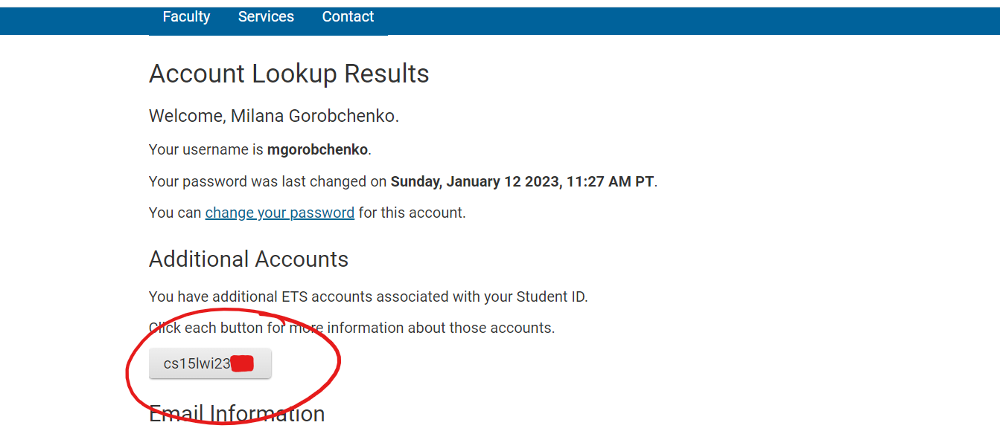
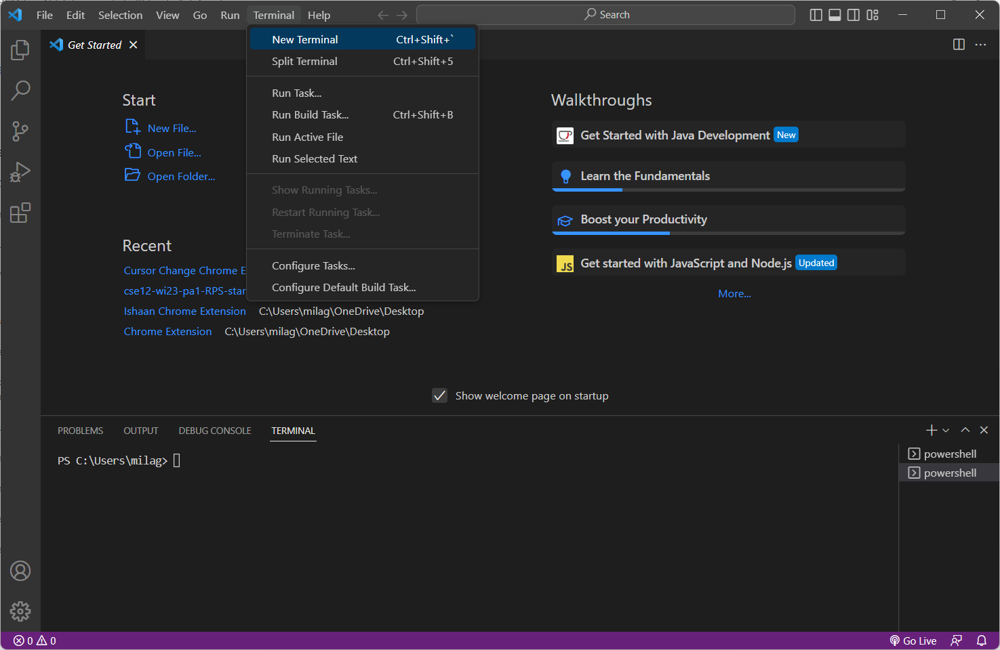
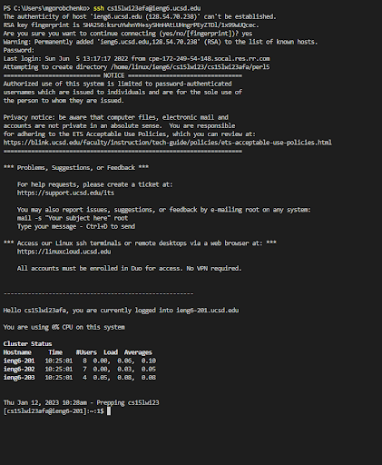
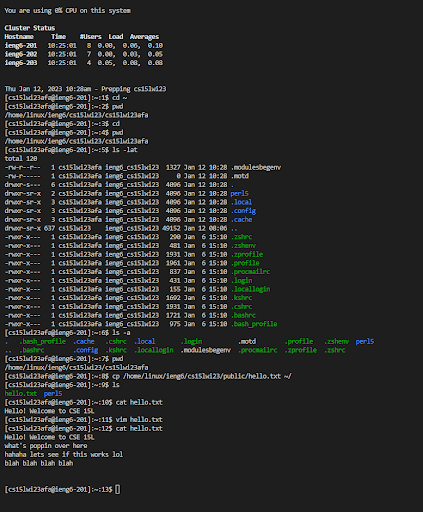

# CSE 15L Lab 1

*A simple tutorial on how to connect to the remote server at UCSD (ieng6) through the course-specific student account.*

> Step 1: Log into course-specific student account

Log into your account on the UCSD Educational Technology Services site using this [link](https://sdacs.ucsd.edu/~icc/index.php). Lookup your account if you already reset your password. If you have never logged in before, reset your password following [this tutorial](https://docs.google.com/document/d/1hs7CyQeh-MdUfM9uv99i8tqfneos6Y8bDU0uhn1wqho/edit).

Once you are in, you should see a section near the top of the page displaying additional accounts, including one that begins with *cs15lwi23*. Make a note of this account username because you will use it to log in later. 



> Step 2: Set up and open a new window in Visual Studio Code

If you do not have Visual Studio Code, go to the main VSCode website using this [link](https://code.visualstudio.com/) and click the download button. Complete the proper installation steps for your operating system to get it properly installed.

If Visual Studio Code is installed, you can double click on the app icon to open up a new window or click on *File>New Window*. To open the terminal window, click on *Terminal>New Terminal*.



> Step 3: Connecting to the remote server

In this next step, we will be connecting to a remote computer (UCSD's ieng6 remote server) through the terminal.

Before beginning, make sure *Git Bash* is installed. If it is not installed or if you are not sure, download using this [link](https://gitforwindows.org/).

We will now be typing in some commands which will be distinguished by being displayed in a code block like `this` but do not type the `$`.

```
# The **ssh** command essentially starts running commands on "another" computer, like the remote server. 

$ ssh cs15lwi23##@ieng6.ucsd.edu
```

(The *##* referring to the ending of the account username that you logged into before)

If all goes well and this is your first time connecting to the remote server, you will see a message double checking your connection. Answer `yes` to the questions and when it asks for your password, simply enter the same password that you use to log into UCSD student accounts (the one you reset). 

If at any point you run into problems, type the error into Google or Stack Overflow or ask someone if you are able to help resolve it.

Once connected, you should see some notices about the *server*, or the computer that you remotely connected to. The computer that you are on is called the *client* in this context.



> Step 4: Commands to try out

After connecting to the remote server, you can try out some commands to play around and learn about the server.

Here are some example commands to try!

1. `cd ~` to change directory to the home directory
2. `ls -lat` to list all the files in the directory in a table-like format
3. `ls -a` to list all the filenames in a directory
4. `ls <directory>` where <directory> is /home/linux/ieng6/cs15lwi23/cs15lwi23abc (abc is one of the other group members’ username)
5. `cp /home/linux/ieng6/cs15lwi23/public/hello.txt ~/` to copy a file into the home directory
6. `cat /home/linux/ieng6/cs15lwi23/public/hello.txt` to display the contents of the *hello.txt* file in the public directory'
7. `pwd` to show what the "present working directory" is aka where you are in the computer
8. `vim` to edit a file (press *esc* and type `:wq` to save changes when using vim)

In the following example, I changed the directory to the home directory, used `pwd` to check what directory I’m in. Then I listed all the files in the directory and used -a extension to print all the files in the directory while the -lat extension shows the files and more information about them in a table format. Then, I copied the hello.txt file into the server’s public directory. I used vim to edit the contents of the file as well and checked to see if it worked.



> Step 5: Exiting the server

To log out of the server, either hold down on *Ctrl-D* or type `exit`.
