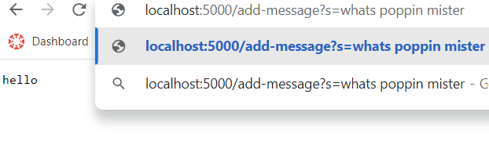
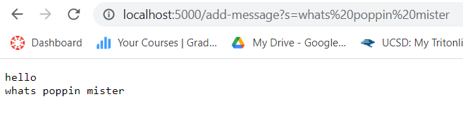
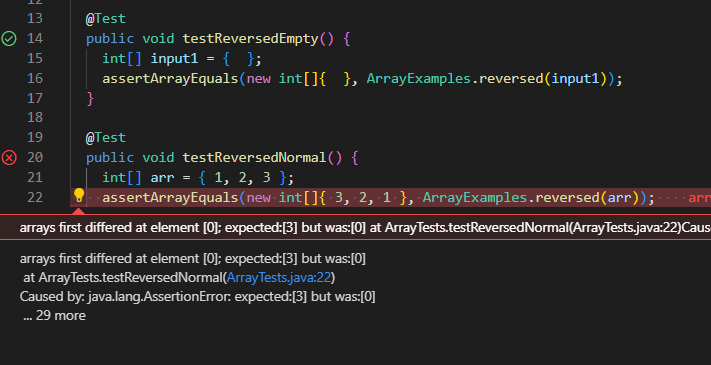

# CSE 15L Lab 2

*Servers and Bugs*

# Part 1

StringServer code

```
import java.io.IOException;
import java.net.URI;

class Handler implements URLHandler {
    // The one bit of state on the server: a number that will be manipulated by
    // various requests.
    String pageString = new String("");

    public String handleRequest(URI url) {
        if (url.getPath().equals("/")) {
            return String.format(this.pageString);
        } else if (url.getPath().contains("/add-message")) {
            String[] parameters = url.getQuery().split("=");
            if (parameters[0].equals("s")) {
                this.pageString += (parameters[1] + "\n");
                return String.format(this.pageString);
            }
        }
        return "404 Not Found!";
    }
}

class StringServer {
    public static void main(String[] args) throws IOException {
        if(args.length == 0){
            System.out.println("Missing port number! Try any number between 1024 to 49151");
            return;
        }

        int port = Integer.parseInt(args[0]);

        Server.start(port, new Handler());
    }
}

```

For the StringServer to work, the *main()* method in the StringServer class is first called upon executing the code. This then creates a handler and reads the command line arguments to create a port on whichever port the user specifies in the terminal. Then, the *handleRequest()* method of the Handler class is called after the Handler object is created that handles any web requests, such as getting certain "pages" based on the paths or working with queries.

The StringServer requires 1 command line argument for the port number to start running the code locally and the *handleRequest()* method requires an argument for the URI object to determine what to do based on the URL. 

 
 
 
 
 
When you add a query to the URL path or reload the page while the server is running on the specified port number, the *handleRequest()* method runs and has a new URI passed on. In the examples shown above, only the query changes. When this happens url path is checked to see if it passes any of the conditions in the method. Since it did contain "add-message", the else-if statement runs and the instance variable, pageString is updated and as you can see, the page shows the newly updated text. 
 
 However, the StringServer does not restart and it keeps listening in for requests or changes after being initially started. 
  
# Part 2

### The (Before) Buggy Method to Test
This method is supposed to take in an integer array as an input and generate a new array and return it with the elements of the original array in reversed order. 

```
static int[] reversed(int[] arr) {
    int[] newArray = new int[arr.length];
    for(int i = 0; i < arr.length; i += 1) {
      arr[i] = newArray[arr.length - i - 1];
    }
    return arr;
}
```

### Failure-Inducing Input as JUnit Test

The testReversed() method will fail on an actual array because the method changes the original input array to 0's and returns the original updated array which is incorrect and will not work on any input with a length of more than or equal to 1.

```
@Test
public void testReversedNormal() {
    int[] arr = { 1, 2, 3 };
    assertArrayEquals(new int[]{ 3, 2, 1 }, ArrayExamples.reversed(arr));
}
```

### Non-Failure-Inducing Input as JUnit Test

The testReversed() method works on an empty array since it also returns an empty array.

```
@Test
public void testReversedEmpty() {
    int[] input1 = {  };
    assertArrayEquals(new int[]{  }, ArrayExamples.reversed(input1));
}
```

### Symptom of Running Tests

As you can see in the screenshot, the first test on an empty array does not induce an error but the second test on a three element array fails because all of the elements are set to 0.



### Code Fix

#### Before
```
static int[] reversed(int[] arr) {
    int[] newArray = new int[arr.length];
    for(int i = 0; i < arr.length; i += 1) {
      arr[i] = newArray[arr.length - i - 1];
    }
    return arr;
}
```

#### After
```
static int[] reversed(int[] arr) {
    int[] newArray = new int[arr.length];
    for(int i = 0; i < arr.length; i += 1) {
      newArray[i] = arr[arr.length - i - 1];
    }
    return newArray;
}
```

**The code fix involved making sure that the new array is updated, not the elements of the old one with the null newArray elements. We also made a fix to make sure that the created newArray is returned, not the original input array.**
  
# Part 3
  
In lab 2, I learned that Java has an interface called *URIHandler* and it has a *Server.start()* method which makes creating the web server easy to do because you just pass on the Handler object you are using and what port to host it on locally. You also have to create a special Handler class which implements the URI interface in order to handle requests; you can handle requests on the website, such as interpreting paths, returning text, or making queries, by overriding the *handleRequest()* method in the Handler class. 
