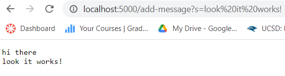
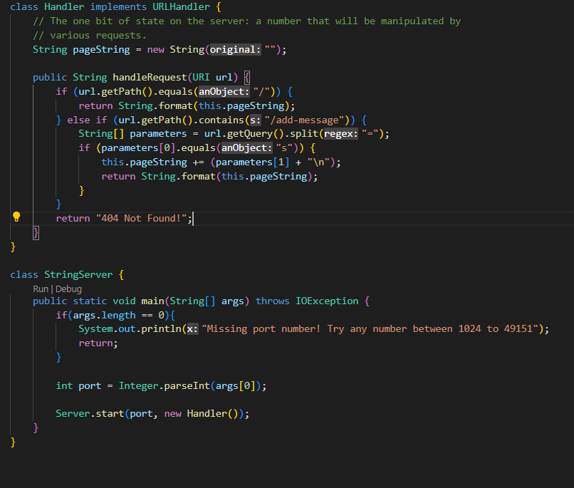
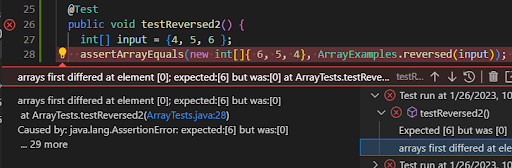

# CSE 15L Lab 2

*Servers and Bugs*

# Part 1

 
 
  
 

 
  
# Part 2

A failure-inducing input for the buggy program, as a JUnit test and any associated code (write it as a code block in Markdown)
An input that doesn’t induce a failure, as a JUnit test and any associated code (write it as a code block in Markdown)
The symptom, as the output of running the tests (provide it as a screenshot of running JUnit with at least the two inputs above)
The bug, as the before-and-after code change required to fix it (as two code blocks in Markdown)
Briefly describe why the fix addresses the issue.

### Failure-Inducing Input as JUnit Test

```
@Test
public void testReverseInPlace() {
    int[] input1 = { 3 };
    ArrayExamples.reverseInPlace(input1);
    assertArrayEquals(new int[]{ 3 }, input1);
}
```

### Non-Failure-Inducing Input as JUnit Test

```
@Test
public void testReverseInPlace() {
    int[] input1 = { 3 };
    ArrayExamples.reverseInPlace(input1);
    assertArrayEquals(new int[]{ 3 }, input1);
}
```

### Symptom of Running Tests


### Code Fix

#### Before
```
@Test
public void testReverseInPlace() {
    int[] input1 = { 3 };
    ArrayExamples.reverseInPlace(input1);
    assertArrayEquals(new int[]{ 3 }, input1);
}
```

#### After
```
@Test
public void testReverseInPlace() {
    int[] input1 = { 3 };
    ArrayExamples.reverseInPlace(input1);
    assertArrayEquals(new int[]{ 3 }, input1);
}
```
  
# Part 3
  
In lab 2, I learned how to make a web server with Java which is something that I have never done before. I learned that Java has an interface called *URIHandler*. I also learned that Java has a *Server.start()* method which makes creating the web server easy to do because you just pass on the Handler object you are using and what port to host it on locally. You also have to create a special Handler class which implements the URI interface in order to handle requests. You can handle requests on the website, such as interpreting paths, returning text, or making queries, by overriding the *handleRequest()* method in the Handler class. 
